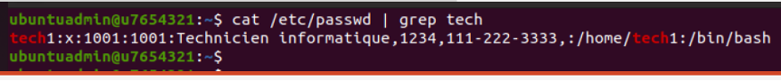
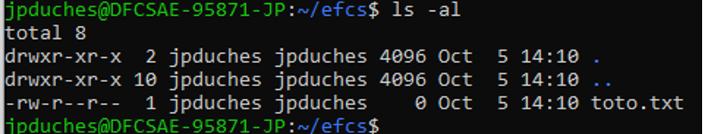
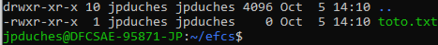

# Évaluation finale à caractère synthèse

### Informations

- Évaluation : 25 % de la session (15 % pour la partie pratique et 10 % pour la partie questionnaire).
- Type de travail : individuel.
- Date de remise : voir sur léa.
- Durée : 10 heures, dont 2 séances officielles en ligne. 
- Système d’exploitation : Linux / Docker
- Environnement : virtuel / Docker.

### Objectifs

- Appliquer des procédures d’Installation des services Internet conformément aux procédures et spécifications techniques.  
- Configurer des services Internet selon la documentation ou le plan de conception (Ex. : architecture réseau, technologique, etc.).  
- Tester adéquatement le fonctionnement des services Internet.  
- Activer des services Internet selon les procédures recommandées.  
- Appliquer des correctifs et des mises à jour sur les systèmes d’exploitation serveur.  


### Description

Cette épreuve à caractère synthèse à deux sections.  

La première section sera un travail pratique où vous aurez les tâches suivantes à accomplir:  

- Faire une installation complète d’un site Web avec équilibrage de charge.  
- Utiliser Nginx comme un équilibreur/répartiteur de charge (load balancer).  
- Utiliser Apache (httpd) comme serveur de contenus.  
- Utiliser php-fpm comme fastCgi.  
- Utiliser MySQL comme serveur de base de données.  
- Le tout automatisé avec Ansible et avec l'utilisation de conteneur.  

La deuxième section sera un questionnaire récapitulatif du cours.

## Section 1 : Déploiement d'un environnement avec Ansible

### Description de l'infrastructure

Vous allez utiliser Nginx comme équilibreur de charge pour avoir une structure comme celle-ci :


**Attention :** même si sur l'image les deux serveurs php point vers un seul serveur MySQL, vous allez implanter 2 serveurs MySQL.

Donc, on se connecte sur <code>www.efcs.com</code> qui appelle le proxy nginx qui lui appelle en alternance les serveurs 1 et 2. Chacun des serveurs est relié à un serveur php et à un serveur MySQL.  

- Vous aurez trois VMs serveurs : une pour l'équilibreur de charge et deux pour les serveurs Web (n'oubliez pas de renommer vos VMs, de créer les utilisateurs...)  
	- Utiliser le gabarit DFC DS -> VM DFC -> Modeles -> ClaudeRoy -> TPL\_20220110\_UbSrv2004_Small.  
	- Utilisez les noms de VMs : `srv-lb1-[matricule]`, `srv-web1-[matricule]`, `srv-web2-[matricule]`.
- Les services seront des conteneurs.  
- Les deux serveurs Web doivent être identiques, à part une information, dans la page Web, qui permet de distinguer le serveur 1 et le serveur 2 : par exemple le hostname ou/et l'adresse IP.  
- Les serveurs httpd seront reliés à un réseau avant pour la communication extérieur.  
- Les serveurs httpd auront chacun leur réseau arrière pour communiquer avec leurs serveurs php et MySQL.  
- Le fichier de configuration de httpd.conf doit être monté par un point de montage au fichier httpd.conf du conteneur.
- Le contenu des serveurs httpd doit être monté par un point de montage à un répertoire de la VM.  
- Le serveur MySQL doit avoir un volume de données persistant dans la VM.  
- Vous devrez démontrer le système fonctionnel.  

**Attention :** ne mettez pas de dépendance aux serveurs httpd.

### Ansible 

#### Spécifications pour les noeuds gérés :

- Un fichier d'inventaire en format YAML doit contenir :  
	- Tous les hôtes via le groupe "all" et ils devront avoir pour login <code>admin</code>.
	- Ne pas inclure le noeud de contrôle dans l'inventaire.  
	- Vous devez avoir un groupe _lbservers_ pour l'équilibreur de charge et un groupe _webservers_ pour les serveurs Web.
	- Les noeuds gérés devront également faire partie d'un groupe appeler _prod_ (consulter la documentation sur le principe parent-enfant).  
- Le mot de passe à utiliser pour toutes les connexions ssh devra être ***CegepSt&Foy2023*** pour toutes les machines du groupe _prod_.  
- Les mots de passe doivent être placés dans un fichier chiffrer par Ansible Vault. Le mot de passe pour l'Ansible Vault est <code>secret</code>.  
- La variable _env_ devra être égale à _production_ pour toutes les machines du group _prod_. La variable doit être placée dans une variable de groupe.  

#### Vous devez avoir des playbook pour :

- LoadBalancer
- Web : gère également php et MySQL

#### Votre déploiement :

- Se fait avec une seule commande et reproduit toute l'architecture : vous allez avoir un playbook nommé <code>deploiement.yaml</code>.

## Section 2 : Questionnaire

Vous devez répondre aux questions suivantes. Vos réponses seront incluses dans votre dépôt GitHub (voir la section remises).

### Concept 1 – Administration système – 16 points

1- Dans logical volume manager, expliquer la différence entre les volumes physiques, le groupe de volume et les volumes logiques. (3 points)  

Réponse : 


2- Nommez les trois types de connexion à distance présentés dans le cours et expliquez leurs raisons d’être. (3 points)  

Réponse : 
 - SSH : Connexion sécurisée, nécéssite d'avoir la clef publique de la machine voulant accéder sur la machine voulant recevoir
 - Telnet : Historique, en désuétude au profit de SSH
 - FTP : Transfert rapide et facile permettant de copier et supprimer des fichiers

Les trois prochaines questions font références à l'image suivante :  
 
 
3- Pourquoi le deuxième champ du résultat de la commande est-il marqué d’un X ?
 (1 point)

Réponse : 
 - Le x indique qu'un mot de passe crypté est stocké dans /etc/shadow_file

4- Donnez la raison d’être du dernier champ. (1 point)

Réponse : 
 - Permet de savoir que le mot de pass est crypté

5- Est-ce qu’une autre valeur peut exister pour ce dernier champ ? Si oui, précisez. (1 point)

Réponse : 
 - Oui, le mot de passe haché lui-même, mais plus sur la plupart des systèmes linux modernes.

Les quatres prochaines questions font références à l'image suivante :  
  
 
6- Quelle information vous donne la ligne se terminant par un point ? (1 point) 

Réponse : 
 - Les informations concernant le dossier courant

7- Quelle information vous donne la ligne se terminant par deux points ? (1 point) 

Réponse : 
 - Les informations du dossier parent

8- Quels sont les droits sur le fichier toto.txt ? (3 points)

Réponse : 
 - Possesseur : lecture et écriture
 - Groupe : lecture
 - Le reste : lecture


9- Quelle commande (en forme octale), allez-vous utiliser pour modifier les droits sur le fichier toto.txt pour que ceux-ci soient maintenant les suivants : (2 points)  
  

Réponse : 
 - `chmod 755 toto.txt`

### Concept 2 – Docker – 17 points

Soit le fichier « Dockerfile » suivant :  

|#  | Instruction|
|---|---|
|1	 |FROM mcr.microsoft.com/dotnet/core/sdk:3.0 AS build|
|2	 |WORKDIR /app|
|3	 |COPY *.sln .|
|4	 |COPY aspnetapp/*.csproj ./aspnetapp/|
|5	 |RUN dotnet restore/|
|6	 |COPY aspnetapp/. ./aspnetapp/|
|7	 |WORKDIR /app/aspnetapp|
|8	 |RUN dotnet publish -c Release -o out|
|9	 ||
|10 |FROM mcr.microsoft.com/dotnet/core/aspnet:3.0 AS runtime|
|11 |WORKDIR /app|
|12 |COPY --from=build /app/aspnetapp/out ./|
|13	 |ENTRYPOINT ["dotnet", "aspnetapp.dll"]|

10- Donnez l’explication de chaque ligne du fichier (3 points)

|#  | Instruction|
|---|---|
|1| Dicte que l'image parent de l'étape est la version 3.0 de la distribution mcr.microsoft.com/dotnet/core/sdk et nomme l'étape `build` |	
|2| Change le répertoire de travail en `/app` |	
|3| Copie tous les fichiers du dossier courant de la machine source d'extension `.sln` dans le dossier courant du conteneur (`/app`) |	
|4| Copie tous les fichiers du dossier `aspnetapp` enfant du courant de la machine source d'extension `.csproj` dans le dossier `/app/aspnetapp` |	
|5| Lance la commande `dotnet restore/` (devrait avoir un espace entre le restore et le /), cette commande restaure les dépendances et outils d'un projet .NET |	
|6| Copie le contenu du dossier `./aspnetapp` de la machine source dans le dossier `/app/aspnetapp` du conteneur |	
|7| Change le répertoire de travail en `/app/aspnetapp` |	
|8| Lance la commande `dotnet publish -c Release -o out` qui compile le projet du dossier courant en version de release dans le dossier `/app/aspnetapp/out` |	
|9| Ne fait rien |	
|10| Dicte que l'image parent de l'étape est mcr.microsoft.com/dotnet/core/aspnet:3.0 et nomme l'étape `runtime` |	
|11| Change le répertoire de travail en `/app` |	
|12| Copie le contenu du dossier `/app/aspnetapp/out` de l'étape de build dans le dossier courant (`/app`) |	
|13| Configure la commande lancée après l'initialisation du conteneur comme étant `dotnet aspnetapp.dll` |	

11- Dans un Dockerfile, expliquez la différence entre « ENTRYPOINT » et « CMD ». (1 point)

Réponse :
 - `ENTRYPOINT`, contrairement à CMD, n'ignore pas les paramètres passés dans le `docker run`

12- À quoi servent les volumes dans Docker ? Expliquez ce qui peut se passer sans. (2 points)

Réponse :
 - Ils servent à faire de la persistance de donnée. Sans eux, les données présentes dans le conteneur seront perdues à la fermeture du conteneur

13- Quels sont les différents types de volumes dans Docker ? Expliquez l’utilisation des deux types utilisés dans le cours. (2 points)

Réponse :
 - Bind Mount : associe des fichiers ou dossiers de la machine hôte à un ou plusieurs conteneurs. Pas conseillé puisque expose directement l'intérieur de notre docker à la machine 
 - Volumes : crée un emplacement spécial géré par docker en dehors du conteneur

14- Quels sont les différents types de réseau de base dans Docker ? Expliquez le fonctionnement de chacun des types. En quoi le choix d’un réseau influence-t-il la sécurité ? (4 points)

Réponse :
 - `bridge` : crée un pont entre les différents conteneur (par défaut)
 - `host` : utilise l'IP de l'hôte, brise l'isolation
 - `none` : n'a pas de réseau
 
 Choisir host expose directement la machine hôte au réseau du conteneur compromettant la sécurité 

15- Quel est l’intérêt d’utiliser Docker-Compose ? Qu’-est ce que ça permet de faire ? Qu’elle ait la différence avec Dockerfile ? Dans quel type d’environnement ça peut être utilisé ? (5 points)

Réponse :
 - `docker compose` permet d'organiser un environnement de travail comportant plusieurs conteneurs devant fonctionner ensemble. Ne doit pas être utilisé en production.

### Concept 3 – Les services – 12 points

16- Expliquez la différence entre un serveur et un service. (2 points)

Réponse : 
 - un service est une application servant à résoudre un problème
 - un serveur est un hôte servant à faire tourner un service

17- Dans le serveur Web httpd (Apache), donnez quatre (4) conteneurs (conteneur Apache et non Docker) pouvant accueillir les directives de configuration. (4 points)

Réponse :
 - Directory
 - Files
 - Location
 - VirtualHost

18- À quoi sert la notion d’hôte virtuel dans les serveurs Web. (2 points)

Réponse :
 - Permet à un serveur nginx de gérer plusieurs applications web en même temps

19- Serveur Nginx, dans quel bloc doit être placée la directive listen ? Qu’elle est sa fonction ? (2 points)

Réponse :
 - Dans le bloc serveur. Elle sert à indiquer l'adresse et le port pour lequel le serveur va accepter les requêtes

20- À quoi sert la directive try\_files dans Nginx ? (2 points)

Réponse :
 - Vérifie si le fichier ou répertoire spécifié existe et effectue une redirection interne si oui ou retourne un code de statut si non.
 Peut servir par exemple pour couvrir plusieurs façons d'entrer une url

### Concept 4 – L’automatisation – 5 points

21- À quel endroit intervient l’automatisation d’un processus DevOps ? (3 points)

Réponse :
 - À chaque étape du processus

22- Pourquoi les développeurs ont-ils besoin d’automatisation ? (2 points)

Réponse :
 - Pour économiser du temps, fluidifier les processus, diminuer les coûts, diminuer les risques d'erreur.


## Remise 

Vous devez fournir (déposé sur LÉA) :

- L'adresse de votre dépôt GitHub dans un fichier texte.

Vous devez fournir (déposé sur GitHub) :

  - Un dépôt privé avec votre code source de l'EFCS.
      - Un fichier README.md qui résume les informations sur le dépôt.
    	- Nom du projet  
       - Date 
       - Description du projet  
      - Le dépôt doit inclure le fichier .traces\_d\_ansible. 
  - Un document Markdown nommé `Section2_Reponses.md` contenant les réponses aux questions de la sections 2.  
  - Tous les fichiers de votre travail à l'exception de la vidéo.  
  - Je dois trouver l'adresse (en hyperlien) de votre vidéo dans le fichier readme.md de votre projet.  
  - Vous devez m'ajouter à votre dépôt (claude-roy).
  - Vous devez utiliser le format Markdown (md).
  - Vous devez donner vos sites de références.

Votre vidéo :  

- Une vidéo d'environ 8 min. (maximum 10 min.):  
	- Explication de tous vos fichiers  
	- Démonstration que le site fonctionne avec les deux serveurs

## Évaluation :

### Section 1 : /15  

|Item ||Points  | Résultat|
|--- | --- | :---: | :---:|
|LoadBalancer |||
||Définition des 2 serveurs|5||
||Contexte serveur|5||
|Serveur1/Serveur2 |||
||httpd|5||
||php|5||
||Lien entre php et MySQL |5||
||Page Web d'identification |5||
|Commandes ||||
||Ansible|40||
||Voir les traces (fichier .traces\_d\_ansible) d'ansible |10||
|Compréhension||10||
|**Total** ||**100**||


### Section 2 : /10  

|Question| Points| Résultat|
|---|:---:|:---:|
|1|3||
|2|3||
|3|1||
|4|1||
|5|1||
|6|1||
|7|1||
|8|3||
|9|2||
|10|3||
|11|1||
|12|2||
|13|2||
|14|4||
|15|5||
|16|2||
|17|4||
|18|2||
|19|2||
|20|2||
|21|3||
|22|2||
|**Total**|**50**||


## Informations supplémentaires :

Pour créer un playbook qui regroupe tous les playbook, vous utilisez le module <code>import_playbook</code>.

```yaml
---
- name: Configure LoadBalancer
  ansible.builtin.import_playbook: loadBalancer.yaml
- name: Configure les serveurs Web
  ansible.builtin.import_playbook: Web.yaml

```

Vous pouvez utiliser le module <code>copy</code> dans un playbook :

```yaml
  tasks:
    - name: Telecharger Application
      copy:
        src: ./index.php
        dest: /home/admin/html/index.php
        mode: 0755

```

Pour organiser vos fichiers, vous pouvez créer des répertoires avec le module <code>file</code> :

```yaml
  tasks:
    - name: Creates directory
      ansible.builtin.file:
        path: /home/admin/html
        state: directory
        owner: admin
        group: admin
        mode: 0775
```

## Références :

[A system administrator's guide to getting started with Ansible - FAST!](https://www.redhat.com/en/blog/system-administrators-guide-getting-started-ansible-fast)  
[Documentation ansible pour fichier inventaire avec des relations parent/enfant](https://docs.ansible.com/ansible/latest/inventory_guide/intro_inventory.html#grouping-groups-parent-child-group-relationships)  
[Documentation ansible pour group_vars](https://docs.ansible.com/ansible/latest/inventory_guide/intro_inventory.html#organizing-host-and-group-variables)  
[Documentation ansible pour import_playbook](https://docs.ansible.com/ansible/latest/collections/ansible/builtin/import_playbook_module.html)  
[Documentation ansible pour copy](https://docs.ansible.com/ansible/latest/collections/ansible/builtin/copy_module.html)  
[Documentation ansible pour file](https://docs.ansible.com/ansible/latest/collections/ansible/builtin/file_module.html#file-module)  
[Documentation de Community.Docker](https://docs.ansible.com/ansible/latest/collections/community/docker/index.html#description)  
[Documentation pour une adresse statique sur un serveur Ubuntu 22.04](https://www.linuxtechi.com/static-ip-address-on-ubuntu-server/)  
[Documentation pour l'utilisation de la fonction php_uname](https://www.php.net/manual/en/function.php-uname.php)


