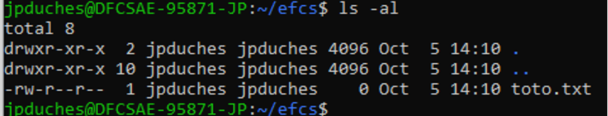
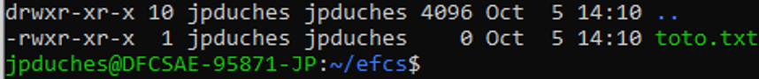

## Section 2 : Questionnaire

Vous devez répondre aux questions suivantes. Vos réponses seront incluses dans votre dépôt GitHub (voir la section remises).

### Concept 1 – Administration système – 16 points

1- Dans logical volume manager, expliquer la différence entre les volumes physiques, le groupe de volume et les volumes logiques. (3 points)  

Réponse : 

2- Nommez les trois types de connexion à distance présentés dans le cours et expliquez leurs raisons d’être. (3 points)  

Réponse : 
 - SSH : Connexion sécurisée, nécéssite d'avoir la clef publique de la machine voulant accéder sur la machine voulant recevoir
 - Telnet : Historique, en désuétude au profit de SSH
 - FTP : Transfert rapide et facile permettant de copier et supprimer des fichiers

Les trois prochaines questions font références à l'image suivante :  
 
 
3- Pourquoi le deuxième champ du résultat de la commande est-il marqué d’un X ?
 (1 point)

Réponse : 
 - Le x indique qu'un mot de passe crypté est stocké dans /etc/shadow_file

4- Donnez la raison d’être du dernier champ. (1 point)

Réponse : 
 - Permet de savoir que le mot de pass est crypté

5- Est-ce qu’une autre valeur peut exister pour ce dernier champ ? Si oui, précisez. (1 point)

Réponse : 
 - Oui, le mot de passe haché lui-même, mais plus sur la plupart des systèmes linux modernes.

Les quatres prochaines questions font références à l'image suivante :  
  
 
6- Quelle information vous donne la ligne se terminant par un point ? (1 point) 

Réponse : 
 - Les informations concernant le dossier courant

7- Quelle information vous donne la ligne se terminant par deux points ? (1 point) 

Réponse : 
 - Les informations du dossier parent

8- Quels sont les droits sur le fichier toto.txt ? (3 points)

Réponse : 
 - Possesseur : lecture et écriture
 - Groupe : lecture
 - Le reste : lecture

9- Quelle commande (en forme octale), allez-vous utiliser pour modifier les droits sur le fichier toto.txt pour que ceux-ci soient maintenant les suivants : (2 points)  
  

Réponse : 
 - `chmod 755 toto.txt`

### Concept 2 – Docker – 17 points

Soit le fichier « Dockerfile » suivant :  

|#  | Instruction|
|---|---|
|1	 |FROM mcr.microsoft.com/dotnet/core/sdk:3.0 AS build|
|2	 |WORKDIR /app|
|3	 |COPY *.sln .|
|4	 |COPY aspnetapp/*.csproj ./aspnetapp/|
|5	 |RUN dotnet restore/|
|6	 |COPY aspnetapp/. ./aspnetapp/|
|7	 |WORKDIR /app/aspnetapp|
|8	 |RUN dotnet publish -c Release -o out|
|9	 ||
|10 |FROM mcr.microsoft.com/dotnet/core/aspnet:3.0 AS runtime|
|11 |WORKDIR /app|
|12 |COPY --from=build /app/aspnetapp/out ./|
|13	 |ENTRYPOINT ["dotnet", "aspnetapp.dll"]|

10- Donnez l’explication de chaque ligne du fichier (3 points)

|#  | Instruction|
|---|---|
|1| Dicte que l'image parent de l'étape est la version 3.0 de la distribution mcr.microsoft.com/dotnet/core/sdk et nomme l'étape `build` |	
|2| Change le répertoire de travail en `/app` |	
|3| Copie tous les fichiers du dossier courant de la machine source d'extension `.sln` dans le dossier courant du conteneur (`/app`) |	
|4| Copie tous les fichiers du dossier `aspnetapp` enfant du courant de la machine source d'extension `.csproj` dans le dossier `/app/aspnetapp` |	
|5| Lance la commande `dotnet restore/` (devrait avoir un espace entre le restore et le /), cette commande restaure les dépendances et outils d'un projet .NET |	
|6| Copie le contenu du dossier `./aspnetapp` de la machine source dans le dossier `/app/aspnetapp` du conteneur |	
|7| Change le répertoire de travail en `/app/aspnetapp` |	
|8| Lance la commande `dotnet publish -c Release -o out` qui compile le projet du dossier courant en version de release dans le dossier `/app/aspnetapp/out` |	
|9| Ne fait rien |	
|10| Dicte que l'image parent de l'étape est mcr.microsoft.com/dotnet/core/aspnet:3.0 et nomme l'étape `runtime` |	
|11| Change le répertoire de travail en `/app` |	
|12| Copie le contenu du dossier `/app/aspnetapp/out` de l'étape de build dans le dossier courant (`/app`) |	
|13| Configure la commande lancée après l'initialisation du conteneur comme étant `dotnet aspnetapp.dll` |	

11- Dans un Dockerfile, expliquez la différence entre « ENTRYPOINT » et « CMD ». (1 point)

Réponse :
 - `ENTRYPOINT`, contrairement à CMD, n'ignore pas les paramètres passés dans le `docker run`

12- À quoi servent les volumes dans Docker ? Expliquez ce qui peut se passer sans. (2 points)

Réponse :
 - Ils servent à faire de la persistance de donnée. Sans eux, les données présentes dans le conteneur seront perdues à la fermeture du conteneur

13- Quels sont les différents types de volumes dans Docker ? Expliquez l’utilisation des deux types utilisés dans le cours. (2 points)

Réponse :
 - Bind Mount : associe des fichiers ou dossiers de la machine hôte à un ou plusieurs conteneurs. Pas conseillé puisque expose directement l'intérieur de notre docker à la machine 
 - Volumes : crée un emplacement spécial géré par docker en dehors du conteneur

14- Quels sont les différents types de réseau de base dans Docker ? Expliquez le fonctionnement de chacun des types. En quoi le choix d’un réseau influence-t-il la sécurité ? (4 points)

Réponse :
 - `bridge` : crée un pont entre les différents conteneur (par défaut)
 - `host` : utilise l'IP de l'hôte, brise l'isolation
 - `none` : n'a pas de réseau
 
 Choisir host expose directement la machine hôte au réseau du conteneur compromettant la sécurité 

15- Quel est l’intérêt d’utiliser Docker-Compose ? Qu’-est ce que ça permet de faire ? Qu’elle ait la différence avec Dockerfile ? Dans quel type d’environnement ça peut être utilisé ? (5 points)

Réponse :
 - `docker compose` permet d'organiser un environnement de travail comportant plusieurs conteneurs devant fonctionner ensemble. Ne doit pas être utilisé en production.

### Concept 3 – Les services – 12 points

16- Expliquez la différence entre un serveur et un service. (2 points)

Réponse : 
 - un service est une application servant à résoudre un problème
 - un serveur est un hôte servant à faire tourner un service

17- Dans le serveur Web httpd (Apache), donnez quatre (4) conteneurs (conteneur Apache et non Docker) pouvant accueillir les directives de configuration. (4 points)

Réponse :
 - Directory
 - Files
 - Location
 - VirtualHost

18- À quoi sert la notion d’hôte virtuel dans les serveurs Web. (2 points)

Réponse :
 - Permet à un serveur nginx de gérer plusieurs applications web en même temps

19- Serveur Nginx, dans quel bloc doit être placée la directive listen ? Qu’elle est sa fonction ? (2 points)

Réponse :
 - Dans le bloc serveur. Elle sert à indiquer l'adresse et le port pour lequel le serveur va accepter les requêtes

20- À quoi sert la directive try\_files dans Nginx ? (2 points)

Réponse :
 - Vérifie si le fichier ou répertoire spécifié existe et effectue une redirection interne si oui ou retourne un code de statut si non.
 Peut servir par exemple pour couvrir plusieurs façons d'entrer une url

### Concept 4 – L’automatisation – 5 points

21- À quel endroit intervient l’automatisation d’un processus DevOps ? (3 points)

Réponse :
 - Developpement, intégration, testing, déploiement, documentation et monitoring

22- Pourquoi les développeurs ont-ils besoin d’automatisation ? (2 points)

Réponse :
 - Pour économiser du temps, fluidifier les processus, diminuer les coûts, diminuer les risques d'erreur.

 ### Références
  - Notes de cours
  - https://devops.com/automation-in-devops-advancements-platforms-and-examples/
  - https://nginx.org/en/docs/http/ngx_http_core_module.html
